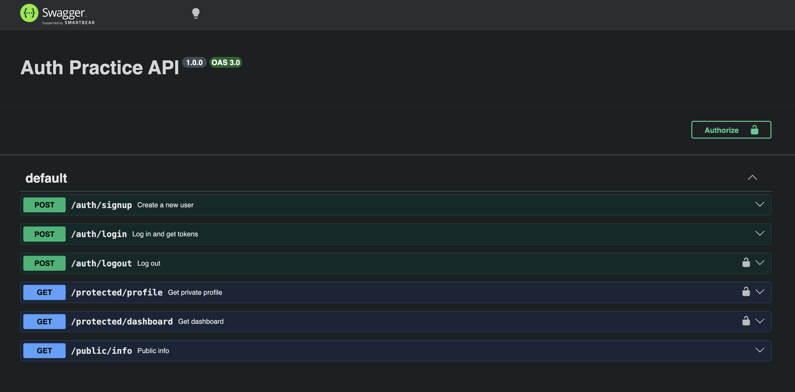

# Auth Practice API

A secure Express API that uses Supabase Auth for sign up, log in and log out, and protects routes with JWT verification.

## Setup

1. Clone the repo and run `npm install`
2. Copy `.env.example` to `.env` and fill in your Supabase values:

```
SUPABASE_URL=your_project_url
SUPABASE_KEY=your_anon_key
PORT=3000
```

## Run

```
npm start
```

Swagger docs: http://localhost:3000/docs

## API Reference

| Method | Route | Auth required | Purpose |
|--------|-------|---------------|---------|
| POST | /auth/signup | No | Create a user |
| POST | /auth/login | No | Log in and get a JWT |
| POST | /auth/logout | Yes | End the session |
| GET | /protected/profile | Yes | Read private profile |
| GET | /protected/dashboard | Yes | Read private dashboard |
| GET | /public/info | No | Public message |

## Swagger

